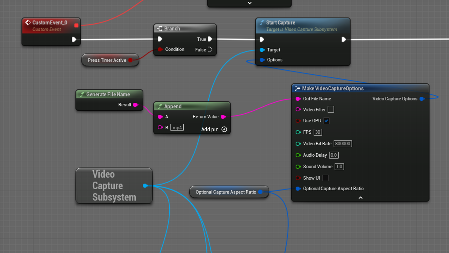
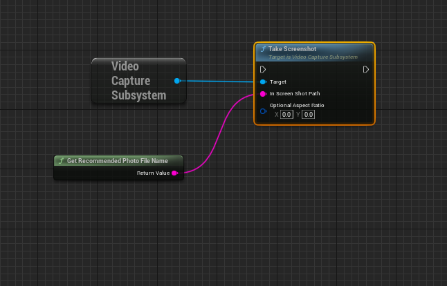

 
# Video And Photo Capture For Unreal Engine

- Based on ffmpeg library
- Supports hardware encoding
- MultiThreaded
- Supports showing and hiding the UI
- Supports screenshots
- Supports horizontal cropping  
Contributions are welcome.

## How to use
   

## TODO : 
- Clean up video capture code and algorithm and use unreal coding standard.
- Remove deprecated libavutil functions.
### Made in collaboration with Serpentine Arts Technologies
